# ✦ BAM GLAM ✦

> Proyecto React en Equipo — TP2 Tecnicatura en Desarrollo Web  
> 🔗 Deploy en Vercel: https://tp2-frontend-22.vercel.app/

---

## Descripción

BAM GLAM es una Single Page Application (SPA) desarrollada con React y Vite para presentar el trabajo práctico del equipo con una interfaz de dashboard glamorosa. La aplicación incluye perfiles individuales, un explorador de zapatos con filtros en tiempo real, consumo de API externa, galería de capitales con lightbox, y se documenta el proceso de desarrollo con bitácora y arquitectura de componentes.

---

## Integrantes

| Nombre | GitHub |
|---|---|
| Andrea Durán | [andreaduran1](https://github.com/andreaduran1) |
| Beatriz González | [Link pendiente](#) |
| Marcela Roig | [roigmar](https://github.com/roigmar) |

---

## Tecnologías Utilizadas

- **React 19** — biblioteca principal de UI
- **Vite** — bundler y servidor de desarrollo
- **React Router DOM** — navegación entre vistas
- **CSS3** — estilos con variables, gradientes y animaciones
- **Google Fonts** — Playfair Display y Raleway
- **JavaScript ES6+** — lógica de componentes y filtrado

---

## Estructura de Archivos

```
public/ 
├── capitales/              # Imágenes de la galería
├── shoes/                  # Imágenes del explorador de zapatos
src/
├── assets/     
│   ├── proyectosAndrea/    # Capturas de proyectos de Andrea
│   ├── proyectosBeatriz/   # Capturas de proyectos de Beatriz
│   ├── proyectosMarcela/   # Capturas de proyectos de Marcela
│   ├── avatar-*.png        # Avatares de las integrantes
│   └── logo-GlamSF.png     # Logo principal del proyecto
├── components/
│   ├── Button/             # Componente botón reutilizable
│   ├── Carrusel/           # Carrusel de proyectos
│   ├── Layout/             # Contenedor general y splash screen
│   ├── Lightbox/           # Modal de galería con navegación
│   ├── ProductCard/        # Cards de producto y API
│   ├── RenderNode/         # Nodo del árbol de componentes
│   ├── Sidebar/            # Navegación lateral fija
│   ├── SkillBar/           # Barras de habilidad animadas
│   └── TechBadge/          # Badges de tecnologías
├── data/
│   ├── integrantes.js      # Datos del equipo, proyectos y tech stack
│   ├── zapatos.json        # Datos del explorador de zapatos
│   ├── capitales.json      # Datos de la galería de capitales
│   └── hitos.json          # Bitácora de desarrollo
├── views/
│   ├── Api/                # Consumo de API pública y paginación
│   ├── Arquitectura/       # Diagrama visual del árbol de componentes
│   ├── Explorador/         # Vista de filtro y búsqueda de zapatos
│   ├── Galeria/            # Vista de fotos con lightbox interactivo
│   ├── Home/               # Dashboard de integrantes
│   ├── Perfil/             # Perfil individual por integrante
│   └── Bitacora/           # Registro de hitos del proyecto
├── App.jsx                 # Configuración de rutas con React Router
├── main.jsx                # Punto de entrada y renderizado
└── App.css                 # Variables globales, import de fuentes y reset
```

---

## Guía de Estilos

### Paleta de Colores

| Variable | Hex | Uso |
|---|---|---|
| `--dorado` | `#B8860B` | Títulos y acentos principales |
| `--dorado-claro` | `#D4AF37` | Gradientes y botones |
| `--rosa-glam` | `#F5A7C7` | Nodos de vistas, acentos |
| `--rosa-fuerte` | `#E91E8C` | Bordes activos |
| `--champagne` | `#F7E7CE` | Fondo sidebar |
| `--nude` | `#E8C9A0` | Fondos secundarios y barras |
| `--blanco-perla` | `#FAF8FF` | Fondo principal |
| `--negro-elegante` | `#1A1A2E` | Textos y botón GitHub |
| `--plateado` | `#C0C0C0` | Bordes secundarios |
| `--fondo-principal` | `#FDF6EC` | Background general |

### Tipografías

- **[Playfair Display](https://fonts.google.com/specimen/Playfair+Display)** — títulos y encabezados
- **[Raleway](https://fonts.google.com/specimen/Raleway)** — cuerpo de texto, navegación y botones

### Iconografía

No se utilizó librería de íconos externa — los elementos visuales y los controles se resolvieron con Unicode, CSS y gradientes.

---

## JavaScript / React

### Splash Screen Animado
Al cargar la aplicación se muestra un splash screen con el logo BAM GLAM sobre fondo champagne, con efecto de brillo y fade out suave implementado con `useEffect` y `useState`.
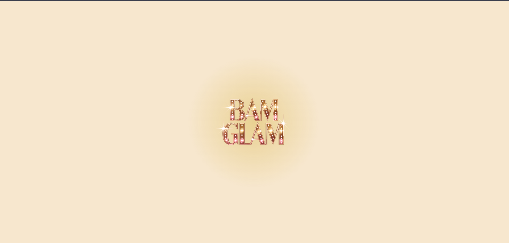

### Dashboard Home
Grilla de tres cards de integrantes con animación `fadeInUp` escalonada. Al hacer click en una card navega al perfil individual usando `useNavigate`.
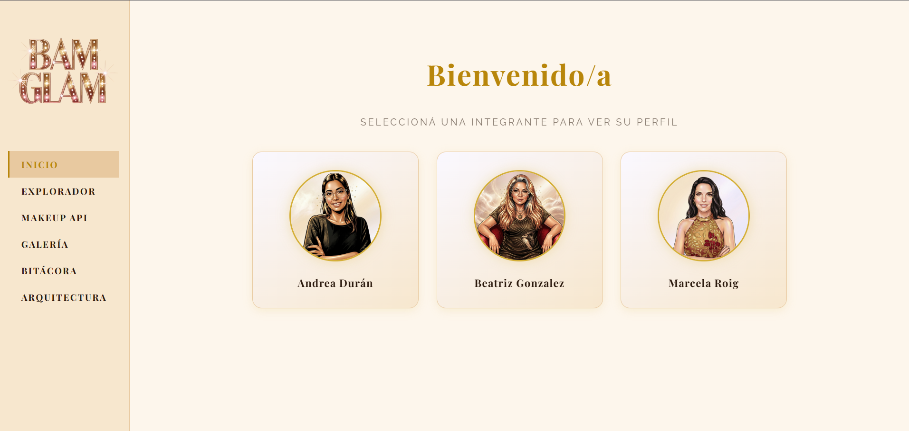
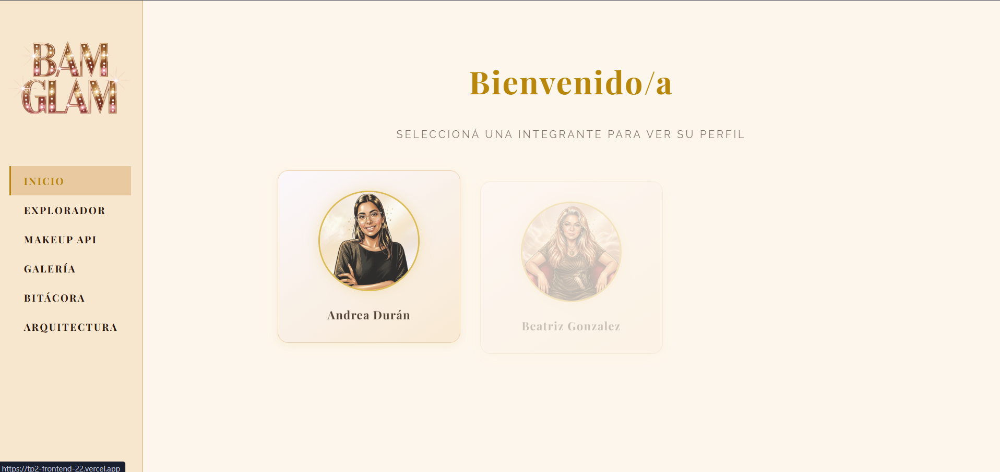

### Perfil Individual Genérico
Un único componente `Perfil.jsx` que usa `useParams()` para leer la URL y cargar los datos del integrante correspondiente desde `integrantes.js`. Incluye:
- Barras de progreso animadas con CSS custom properties (`--nivel`)
- Carrusel de proyectos con controles manuales y puntitos indicadores
- Tech Stack con badges interactivos
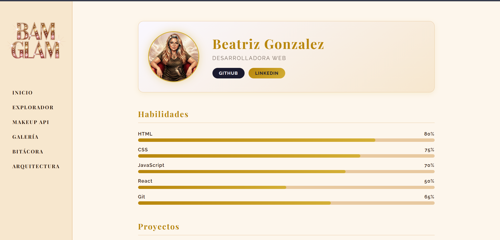
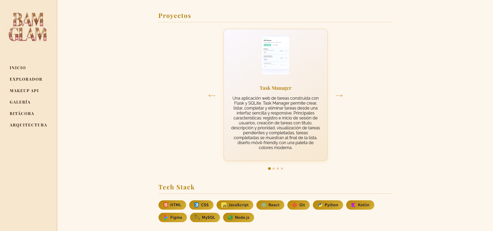

### Explorador de Zapatos
Renderización dinámica de `zapatos.json` con 20 objetos. Incluye buscador por nombre, marca o color en tiempo real y filtros por categoría implementados con `useState` y `.filter()`.
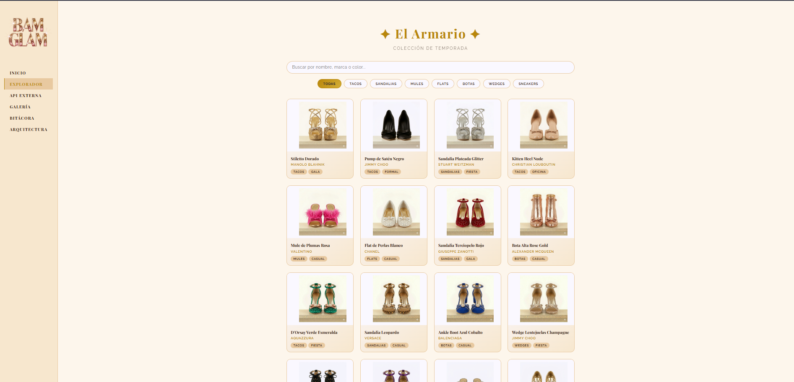

### API Externa
Consumo asíncrono con manejo de estados de carga y error, y sistema de paginación Anterior/Siguiente con indicador de posición.
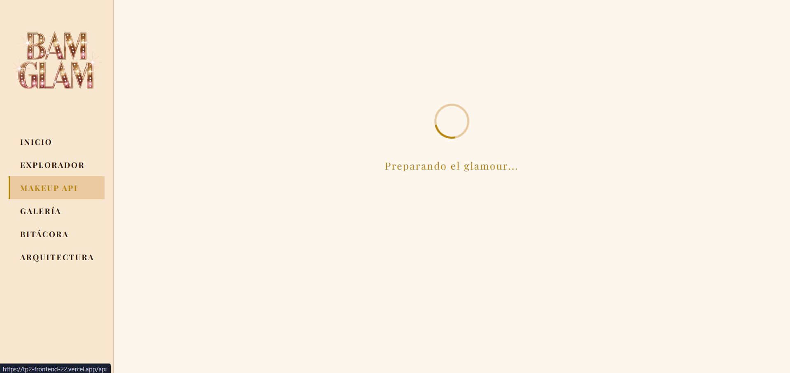
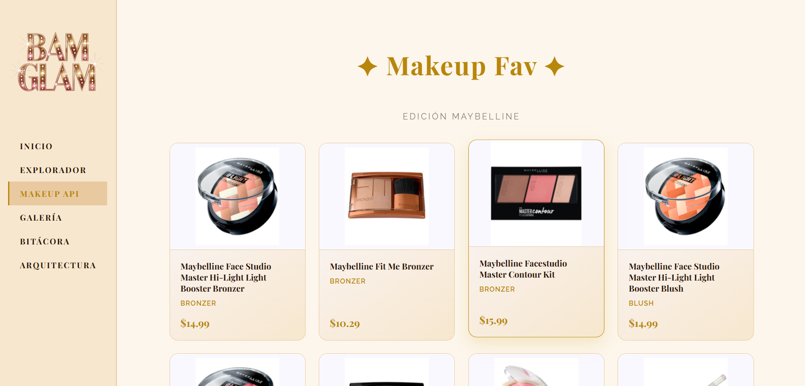

### Galería de Capitales
Grid de imágenes con Lightbox integrado — zoom, navegación interna y cierre con tecla ESC.
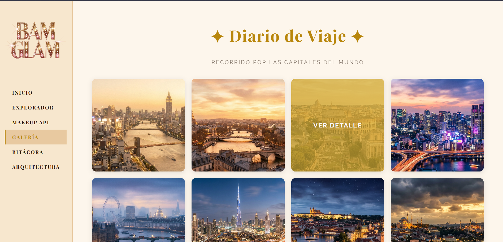
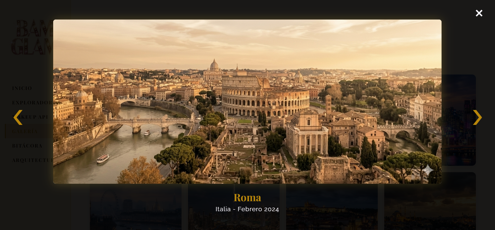

### Árbol de Renderizado
Diagrama visual de la arquitectura de componentes con código HTML/CSS puro, organizado por niveles y codificado por colores según el tipo de nodo (raíz, vista, componente, dato).
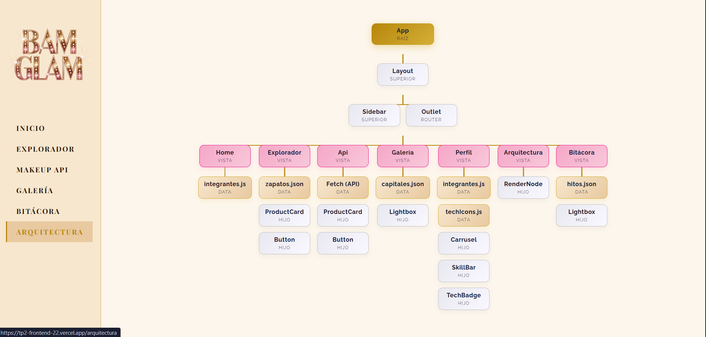
---

## Uso de Inteligencia Artificial

| Herramienta | Uso |
|---|---|
| **Claude (Anthropic)** | Asistencia en lógica de componentes, debugging, estructura de datos y CSS |
| **Ideogram** | Generación del logo BAM GLAM y avatares de las integrantes |

**Contenido generado con IA:**
- Logo BAM GLAM con estilo marquesina dorada
- Avatares glamorosos de cada integrante a partir de fotos de perfil
- Imágenes de zapatos de lujo para el explorador
- Imágenes de paisajes de capitales internacionales para la galería

**Nota:** La IA fue utilizada como asistente de desarrollo. La autoría del proyecto, las decisiones de diseño y la integración del código corresponden al equipo.

---

## Evolución del Proyecto

### TP1 → TP2

| Aspecto | TP1 (HTML/CSS/JS) | TP2 (React) |
|---|---|---|
| Estructura | Archivos HTML separados por página | SPA con componentes reutilizables |
| Navegación | Links entre archivos `.html` | React Router con rutas dinámicas |
| Estilo | Comic book (bordo, negro, tipografía Comic Neue) | Glamour (champagne, dorado, Playfair + Raleway) |
| JavaScript | Manipulación directa del DOM | Estado con `useState` y efectos con `useEffect` |
| Datos | Hardcodeados en el HTML | Separados en archivos `.js` y `.json` |
| Componentes | Ninguno | Layout, Sidebar, Perfil, Explorador, Galería, API |

### Cambios y mejoras incorporadas
- Migración completa a arquitectura de componentes React
- Rediseño visual completo — de estilo cómic a estética BAM GLAM
- Separación de datos y presentación
- Splash screen animado al cargar la aplicación
- Sidebar responsive con menú hamburguesa para mobile
- Componente `Perfil` genérico que reemplaza tres archivos HTML separados

---

## Deploy

🔗 [Ver proyecto en Vercel](https://tp2-frontend-22.vercel.app/) 